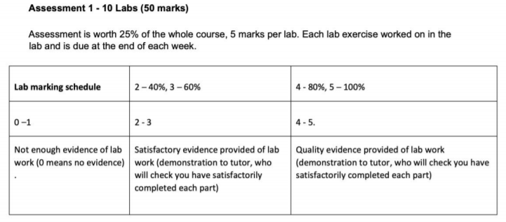
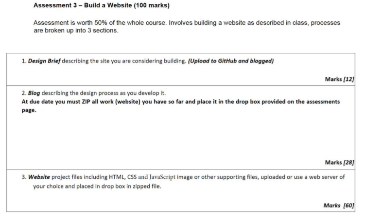

# WEB503, 21/07/2020

## Assessment 1
Journal & Practical Labs
Weighting: 25%
Final Due date: 30th October 2020
10 Labs total.

### Assessment 2
A Student Portfolio Web App
Weighting: 25%
Due Date: TBA
You are required to build a static website using a given generator by the tutor. More details will be provided in the assessment two handout.

#### Assessment 3
A Business Web App (Dynamic Web App)
Weighting: 50%
Date: TBA

|Assessment 1|   |Assessment 2|   |Assessment 3|
|---|---|---|---|---|
|Journal & Practical Labs|   |Student Portfolio Web App|   |Dynamic Business Web App|
|Weighting: 25%|   |Weighting: 25%|   |Weighting: 50%|
|Due Date: 30 October 2020|   |Due Date: TBA|   |Due Date: TBA|
